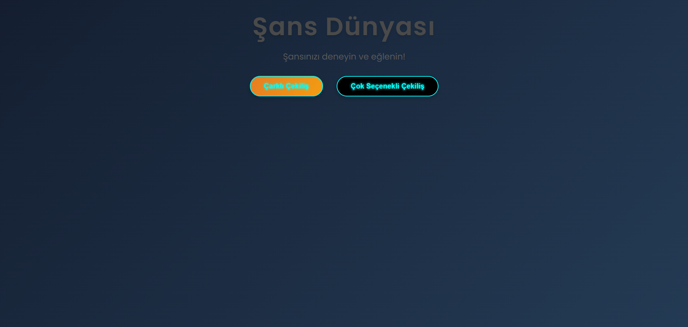
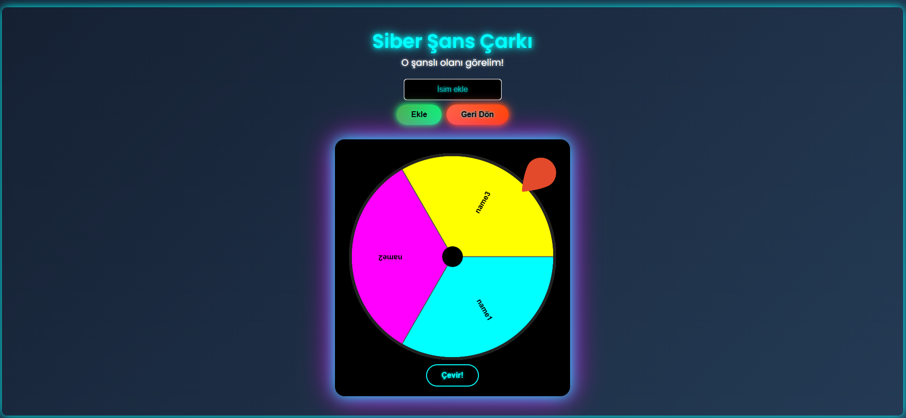
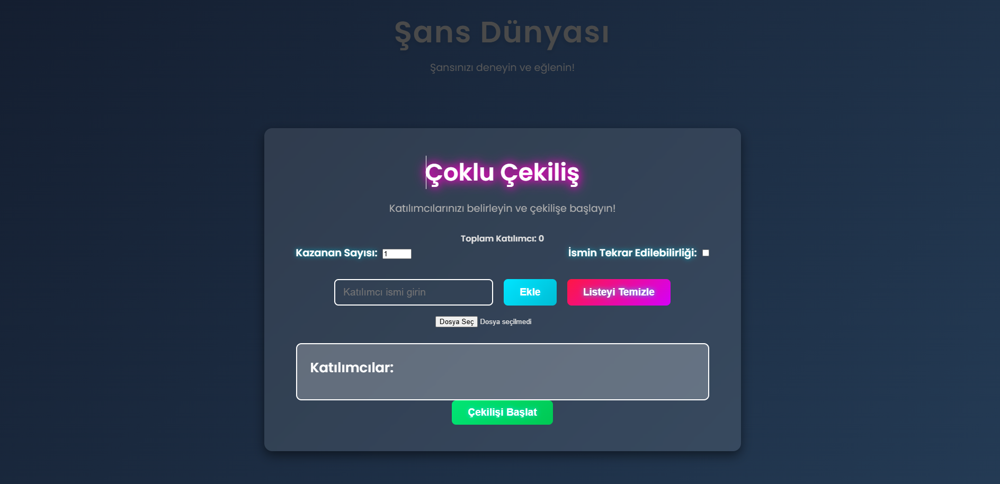
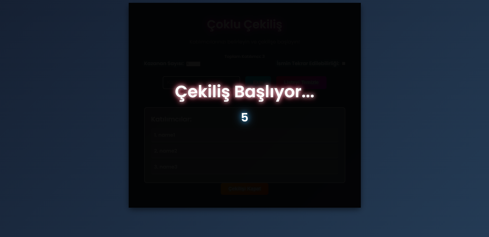

# Lottery Website 🎯

**Lottery Website** is an interactive web application offering multiple lottery drawing modes, including a spinning wheel and multi-option raffles. Experience the thrill of winning with an engaging and dynamic interface!

---

## 🚀 Features
- **Spinning Wheel Draw:** Add participants and spin the wheel to select a lucky winner!
- **Multi-Option Raffle:** Create a participant list, set the number of winners, and let the system choose randomly.
- **Participant Management:** Add names manually or upload from a `.txt` file.
- **Real-Time Animations:** Enjoy confetti effects, winner announcements, and exciting countdowns.
- **Responsive Design:** Works seamlessly on desktops, tablets, and mobile devices.

---

## 🛠️ Technologies Used
- **React.js:** Frontend development framework.
- **React Router:** Navigation and routing.
- **React Custom Roulette:** Spinning wheel functionality.
- **CSS Animations:** Custom styles and transitions.
- **Confetti Effects:** Celebration effects for winner announcements.

---

## 📸 Screenshots


  


---

## ⚙️ Installation & Setup
Follow these steps to run the project locally:

1. **Clone the Repository:**
   ```bash
   git clone https://github.com/username/lottery-website.git
   cd lottery-website
2. **Install Dependencies:**
npm install
3. **Run the Development Server:**
npm start
4. **Open the Application:**
Navigate to http://localhost:3000 in your browser.

**📋 How to Use**
Spinning Wheel Draw
Click the Spinning Wheel Draw button on the homepage.
Enter participant names manually or upload from a .txt file.
Click Spin! to start the draw and see the winner.
Multi-Option Raffle
Click the Multi-Option Raffle button on the homepage.
Add participant names and set the number of winners.
Click Start Raffle to begin the draw and celebrate with confetti!

**💻 Contributing**
We welcome contributions from the community. Feel free to:

Submit a Pull Request
Open an Issue

**📜 License**
This project is licensed under the MIT License. See the LICENSE file for more details.

**👨‍💻 Author**
Developed by Emre Aşkın
Feel free to connect on LinkedIn or view more projects on GitHub.
